# 👋 Hey, I'm **Vedant Salunkhe**

<p align="center">
  
</p>

<p align="center">
  <a href="https://github.com/Vedant-1107">
    
  </a>
  <a href="https://github.com/Vedant-1107?tab=followers">
    
  </a>
  <a href="https://github.com/Vedant-1107?tab=repositories">
    
  </a>
</p>

<p align="center">
  <a href="https://www.linkedin.com/in/vedant-salunkhe-6961b5305">
    
  </a>
  &nbsp;
  <a href="https://www.hackerrank.com/profile/vedantsalunkhe11">
    
  </a>
  &nbsp;
  <a href="https://portfolio-smoky-nu-51.vercel.app">
    
  </a>
</p>

---

## 🧑‍💻 About Me

```text
Computer Engineering Student  →  AI / ML  →  Full-Stack Development
                                      ↓
                         Building useful real-world products
```

I'm a **final-year Computer Engineering student from Pune, India**, interested in building intelligent and scalable software.

My interests sit at the intersection of:

* 🤖 **Artificial Intelligence & Machine Learning**
* 🌐 **Full-Stack Web Development**
* 👁️ **Computer Vision & OCR**
* 📊 **Data Science & Visualization**
* 🧠 **Algorithms & Problem Solving**
* 🛠️ **Developer Tools & AI-powered applications**

I enjoy taking an idea from **"this could be useful" → "let's build it" → "let's deploy it."**

---

## ⚡ Tech Stack

### Languages

<p>

</p>

### Frameworks & Libraries

<p>

</p>

### Databases & Tools

<p>

</p>

### AI / ML

`TensorFlow` `Keras` `LSTM` `GRU` `OpenCV` `OCR` `Scikit-Learn` `Generative AI`

---

# 🚀 Featured Projects

<table>
<tr>

<td width="50%" valign="top">

## 🧠 GitBud

### GitHub Repository Visualizer + AI Assistant

GitBud helps developers understand unfamiliar repositories through **visualization, code analysis, bug detection and AI-generated insights**.

**Tech**

`React` `D3.js` `Python` `AI` `GitHub API`

<a href="https://github.com/Vedant-1107/GitBud">

</a>

</td>

<td width="50%" valign="top">

## 🎬 FlickFinder

### Movie Recommendation System

A movie recommendation platform using **content-based filtering** to recommend similar movies while providing posters, plots, release information and more.

**Tech**

`Flask` `AngularJS` `TMDb API` `Python`

<a href="https://github.com/Vedant-1107/FlickFinder">

</a>

</td>

</tr>

<tr>

<td width="50%" valign="top">

## 🚘 License Plate Recognition

### Real-Time Computer Vision

A real-time vehicle license plate recognition system using **image preprocessing, contour detection and OCR**.

**Tech**

`Python` `OpenCV` `Tesseract`

<a href="https://github.com/Vedant-1107/Licence-Plate-Recognition-System">

</a>

</td>
</tr>
</table>

---

# 🧠 What I've Built

| Area                | Experience                                          |
| ------------------- | --------------------------------------------------- |
| 👁️ Computer Vision | OpenCV, OCR, License Plate Recognition              |
| 🌐 Full Stack       | React, Node.js, Flask, FastAPI                      |
| 🗄️ Databases       | MongoDB, MySQL                                      |
| 📊 Visualization    | D3.js, Data Visualization                           |
| 🔌 APIs             | REST APIs, TMDb API, GitHub API                     |
| ☁️ Deployment       | Vercel, Render                                      |
| 🧩 Algorithms       | DFS, BFS, A*, Greedy, MST, N-Queens, Graph Coloring |

---

# 📊 GitHub Stats

<p align="center">
  
  
</p>

<p align="center">
  
</p>

---

# 📈 Contribution Activity

<p align="center">
  
</p>

---

# 🏆 GitHub Trophies

<p align="center">
  
</p>

---

# 🐍 Contribution Snake

<p align="center">
  <picture>
    <source
      media="(prefers-color-scheme: dark)"
      srcset="https://raw.githubusercontent.com/Vedant-1107/Vedant-1107/gh-pages/github-contribution-grid-snake-dark.svg"
    />
    <source
      media="(prefers-color-scheme: light)"
      srcset="https://raw.githubusercontent.com/Vedant-1107/Vedant-1107/gh-pages/github-contribution-grid-snake.svg"
    />
    
  </picture>
</p>

> If the snake doesn't appear, the GitHub Action needs to be configured in the profile repository.

---

# 🎓 Certifications

<p align="center">

| Certification                  | Platform          |
| ------------------------------ | ----------------- |
| 🟢 MongoDB Developer's Toolkit | GeeksforGeeks     |
| 🔵 Responsive Web Design       | freeCodeCamp      |
| 🟣 AI for Beginners            | HP LIFE           |
| 🟠 What is Generative AI       | LinkedIn Learning |

</p>

---

# 🔭 Currently Exploring

```diff
+ Generative AI
+ RAG Applications
+ LLM-powered Developer Tools
+ AI Agents
+ FastAPI
+ React & TypeScript
+ System Design
+ Cloud Deployment
```

---

# 💡 Problem Solving

I've implemented classic AI and algorithmic approaches including:

`DFS` `BFS` `A*` `Greedy Search` `MST` `N-Queens` `Graph Coloring` `Expert Systems`

My goal isn't just to know an algorithm — it's to understand **when and why to use it.**

---

# 🏅 Achievements & Highlights

```text
┌─────────────────────────────────────────────────┐
│                                                 │
│  💻 Full-Stack Projects                         │
│  🤖 AI / ML Applications                        │
│  👁️ Computer Vision Systems                     │
│  🧠 Algorithm Implementations                    │
│  🌐 Deployed Web Applications                   │
│  📚 Continuous Learning                         │
│                                                 │
└─────────────────────────────────────────────────┘
```

---

# 📌 A Few Things About Me

* 🔨 I prefer **building over just watching tutorials**
* 🧠 I like understanding **how things work under the hood**
* 🤖 AI is one of my biggest areas of exploration
* 🌐 I enjoy connecting AI with practical web applications
* 🧩 I enjoy solving problems that initially look complicated
* 🚀 Always looking for the next interesting project

---

# 🤝 Let's Connect

<p align="center">

<a href="https://www.linkedin.com/in/vedant-salunkhe-6961b5305">

</a>

<a href="https://www.hackerrank.com/profile/vedantsalunkhe11">

</a>

<a href="https://portfolio-smoky-nu-51.vercel.app">

</a>

</p>

---

## 💭 Developer Philosophy

<p align="center">

> *"Code is like humour. When you have to explain it, it's bad."*
> **— Cory House**

</p>

<p align="center">
  I aim to write software that is <b>readable</b>, <b>robust</b>, and <b>useful</b>.
</p>

---

<p align="center">

### 🚀 Let's build the future — one commit at a time.


</p>
